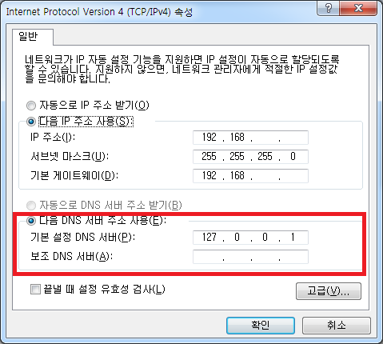

# SecureDNS
DNS proxy service for Cloudflare DOH (DNS over HTTPS) support.

Cloudflare의 DOH 서비스를 사용하여 로컬 PC에 안전한 DNS 연결을 제공합니다.

 * https://developers.cloudflare.com/1.1.1.1/dns-over-https/

설치 방법은 아래를 참조하십시오.

# 제한사항
  * 현 버전은 IPv4만 지원합니다.
  * DOH 서버는 Cloudflare만 지원됩니다.
  * PC의 네트워크 설정(DNS 주소)은 수동으로 변경 해 주셔야 합니다.
  * 지원 운영체제 : Windows 7 이상. Windows 7에서 개발 및 테스트 되었습니다.

# 설치
 1. [설치파일 다운로드 페이지](https://github.com/Regentag/SecureDNS/releases)에서 설치 프로그램을 내려받아 실행합니다.
 1. 제어판 > 네트워크 및 인터넷 > 네트워크 연결 페이지에서 PC의 네트워크 어댑터의 속성 창을 열어
 1. Internet Protocol Version 4 (TCP/IPv4)의 속성에서 DNS 주소를 `127.0.0.1`로 변경합니다.

  

# 제거
  1. 제어판의 `프로그램 제거 또는 변경' 페이지에서 SecureDNS version 1.1을 제거합니다.
  1. 네트워크 사용을 위하여 네트워크 어댑터의 속성에서 DNS 주소를 이전 값으로 되돌립니다.
  1. 어떤 값으로 되돌려야 하는지 모른다면 `1.1.1.1`(CloudFlare DNS)를 사용하세요!

